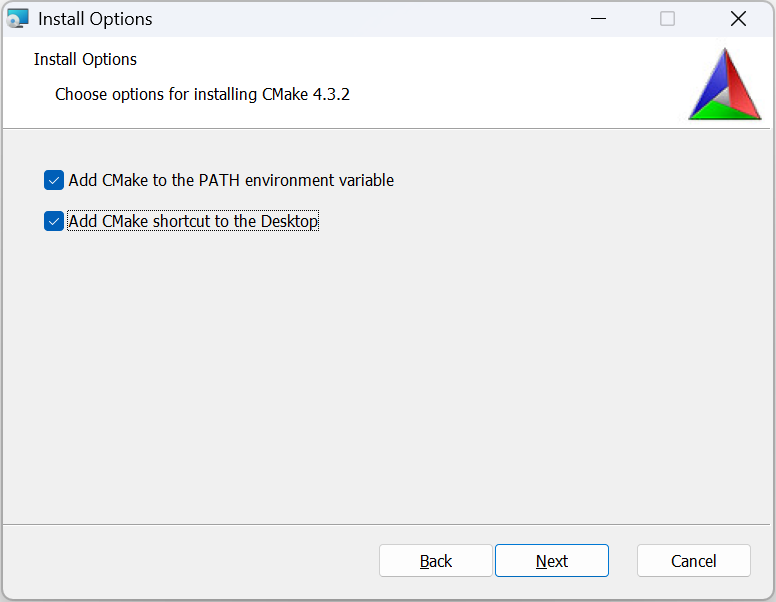
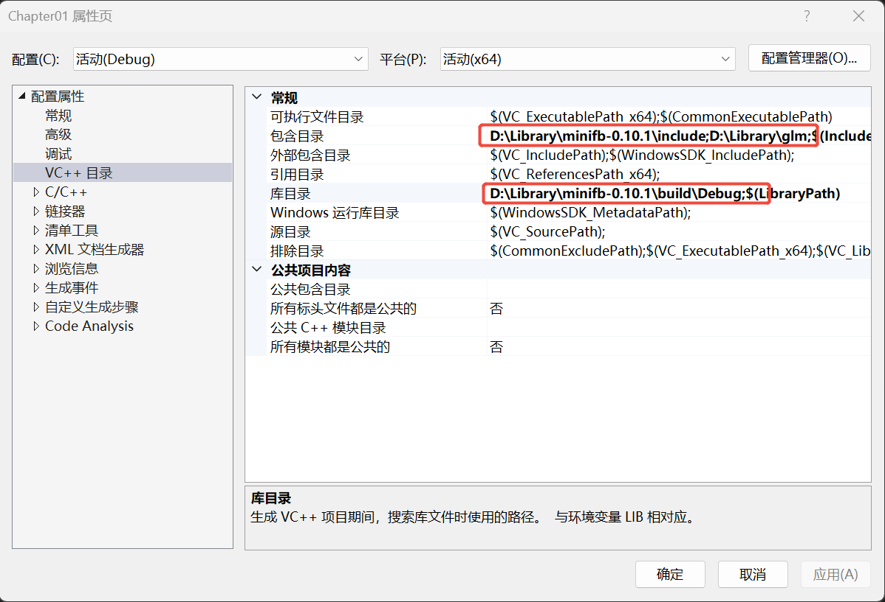
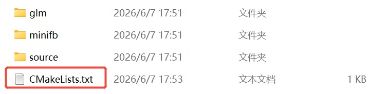

# 《从零打造渲染器》开发环境搭建

## Windows 系统:

#### 1, 下载和安装CMake:

下载地址: https://cmake.org/download/

安装过程和其它windows软件一样,一直点"下一步"就行,唯一需要注意的是在这一步的时候把两个选项都勾选上:



#### 2, 下载 GLM 库(数学库)

地址: https://github.com/g-truc/glm

#### 3, 下载 minifb 库(显示简单的窗口) 
地址: https://github.com/emoon/minifb


<font color="red"><b>从这里开始接下来的步骤,有两种方案:</b></font>

### 方案一(在VS 中设置):

#### 4, 生成minifb二进制库
先用CMake生成minifb的工程文件,然后用VS 打开后编译,编译出lib 文件。

#### 5, 创建并配置自己的工程
5,创建我们自己的VS 工程,然后做打开项目设置:

- **VC++目录选项 -> "包含目录"**(或者"附加包含目录")中,添加GLM库的目录和minifb库的include。 
- **VC++ 目录选项 -> "库目录"中**,添加minifb 库编译好的lib 文件所在目录(注意Debug和Release 要分别选择对应的目录 ):




**"链接器->输入->附加依赖项"** 中,添加如下lib:

```
minifb.lib 
opengl32.lib 
winmm.lib 
kernel32.lib 
user32.lib 
gdi32.lib 
winspool.lib 
shell32.lib 
ole32.lib 
oleaut32.lib 
uuid.lib 
comdlg32.lib 
advapi32.lib
```

### 方案二(用CMake 构建项目):

#### 4, 准备自己的项目目录:

新建一个空的项目目录,然后把`glm`库和`minifb`库的目录都放到它下面。然后新建一个source目录,把我们自己写的cpp和h文件都放到这个source目录下:



#### 5, 编写CMakeLists.txt：

在目录中创建一个CMakeLists.txt文件,并编辑:

```cmake
cmake_minimum_required(VERSION 3.15)
project(RendererSample LANGUAGES CXX)
 
set(CMAKE_CXX_STANDARD 17)
set(CMAKE_CXX_STANDARD_REQUIRED ON)
 
# 项目本身的源文件：
file(GLOB_RECURSE APP_SOURCES CONFIGURE_DEPENDS
    "${CMAKE_SOURCE_DIR}/source/*.cpp"
    "${CMAKE_SOURCE_DIR}/source/*.h"
    "${CMAKE_SOURCE_DIR}/source/*.hpp"
)
 
add_executable(RendererSample ${APP_SOURCES})
 
# 头文件附加目录：minifb/include 和 glm
target_include_directories(RendererSample PRIVATE
    "${CMAKE_SOURCE_DIR}/minifb/include"
    "${CMAKE_SOURCE_DIR}/glm"
)
 
# 添加 minifb 到构建项目：
add_subdirectory(minifb)
 
# 链接库：
target_link_libraries(RendererSample PRIVATE minifb)
if (WIN32)
target_link_libraries(RendererSample PRIVATE
    minifb
    opengl32
    winmm
    kernel32
    user32
    gdi32
    winspool
    shell32
    ole32
    oleaut32
    uuid
    comdlg32
    advapi32)
endif()
```

6,使用CMake生成VS项目,所有的链接库和包含目录已经自动配置好了,直接编译即可。

### 懒人方案:

先保证已安装了CMake
直接下载模板项目: https://github.com/woyaofacai/FortuneRendererTemplate
然后直接双击build.bat

---

## Linux 系统(Ubuntu):

### 1,保证系统已经安装gcc/g++/gdb

```bash
sudo apt install gcc
sudo apt install g++
sudo apt install build-essential gdb
```

### 2,安装以下Library:

```bash
sudo apt install -y libx11-dev libxext-dev libxrandr-dev libxinerama-dev libxcursor-dev mesa-common-dev libgl1-mesa-dev libxkbcommon-dev
```

### 3,安装cmake

```bash
sudo apt install cmake
```

### 4, 构成项目
4,像上面的"方案二"那样准备好项目目录(或者直接下载"懒人方案"中的空模板项目),在终端进入项目目录,输入:

```bash
mkdir build
cd build
cmake ..
make
./FortuneRenderer
```

开发项目可以使用VS Code或者Clion

---

## Mac 系统:

1.仍然需要安装cmake

2.可以直接使用XCode(需要像VS 中一样配置引用目录和链接库)

3.或者可以参考Linux上面的环境搭建，直接使用CMake + VSCode/CLion